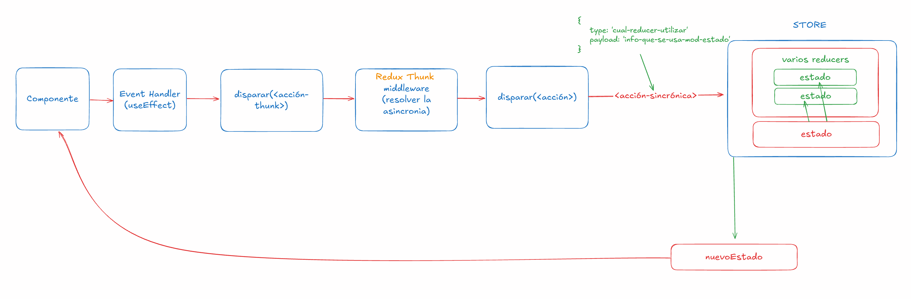

# Trabajando con React Router
Nos permite crear un sistema de navegación a través de componentes y hooks. No necesitamos trabajar directamente con las API del BOM.

<https://reactrouter.com/en/main>

## Instalando React Router

```sh
npm i react-router-dom
```

## Tutorial de React Router 

<https://reactrouter.com/en/main/start/tutorial>

## Pensar en REACT

<https://es.react.dev/learn/thinking-in-react>


## Notificaciones SweetAlert

<https://sweetalert2.github.io/>

### Instalando

<https://sweetalert2.github.io/#download>

```sh
npm install sweetalert2
```

# Workflow de Redux toolkit

